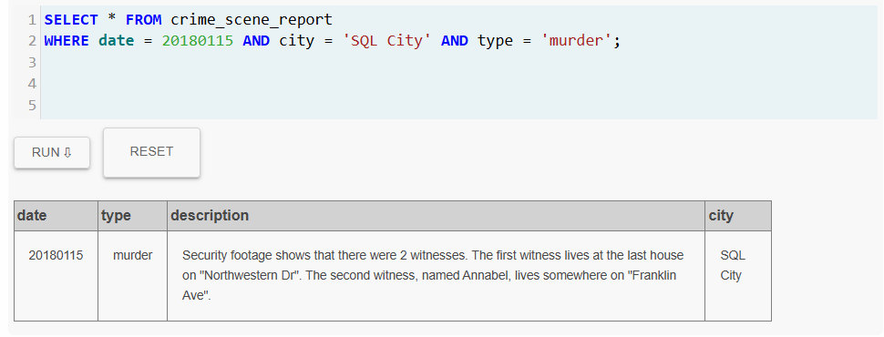

# lab2-sql-murder-FlorindaMeza


## Datos

* **Detective**: Florinda Meza
* **Correo**: florinda.meza@udea.edu.co

## Resumen del Caso

Historia breve...

## Bitácora de Investigación

### Query 1


```sql
SELECT * FROM crime_scene_report 
WHERE date = 20180115 AND city = 'SQL City' AND type = 'murder';
```

**Evidencia**



> **Conclusión**
> 
> Tras analizar los resultados del reporte del crimen en la ciudad SQL se encontro que el dia XXX habian dos asesinatos.

### Query 2


```sql
-- To Do
```

...


## Conclusion

El asesino es xxx


